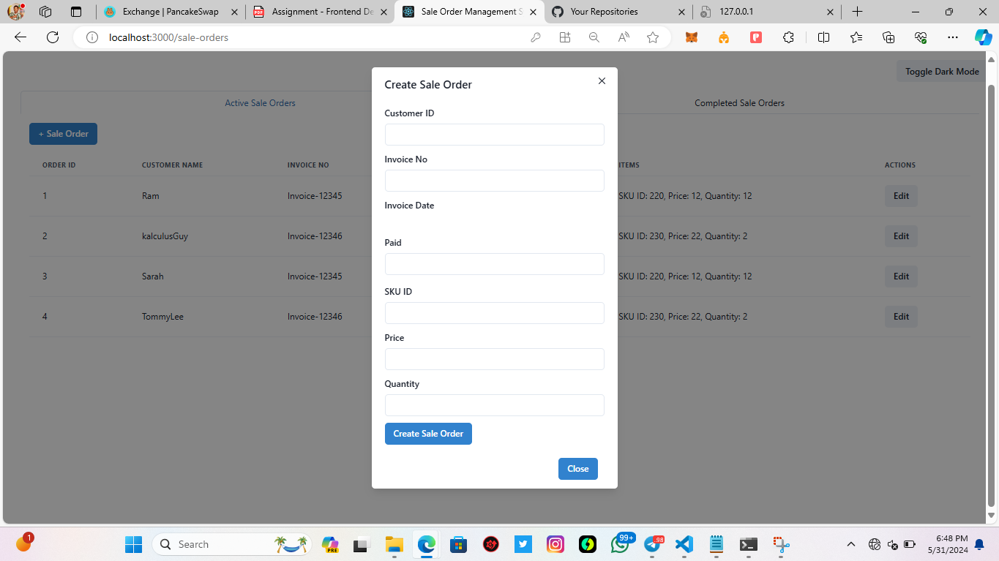

# Sale Order Management Application

## Getting Started

To run this project locally, follow these steps:

1. **Clone the repository**:
    ```bash
    git clone https://github.com/Odeneho-Calculus/SaleOrderManagement.git
    cd SaleOrderManagement
    ```

2. **Install dependencies**:
    ```bash
    npm install
    ```

3. **Run the development server**:
    ```bash
    npm start
    ```

    The application will be available at `http://localhost:3000`.


## Background

This project is a frontend application developed for a consumer goods manufacturing company to manage its sale orders. The company needs to generate sale orders when selling products to retailers or distributors for record-keeping and compliance purposes. This application facilitates the creation, editing, and management of these sale orders.

## Features

1. **Single Page Application**:
    - Includes a login page with a dummy username and password. Unauthenticated users are redirected to the login page.
    
2. **Dark Theme Toggle**:
    - A toggle switch for dark mode, with the theme persisting across reloads.
    
3. **Tabs for Sale Orders**:
    - One tab displays active sale orders.
    - Another tab shows completed sale orders.

4. **Create Sale Order Modal**:
    - A modal triggered by a "+ Sale Order" button, containing a form to create new sale orders.

5. **Edit Sale Order Modal**:
    - A modal triggered by a triple horizontal dots icon in the active sale order row, prefilled with existing details for editing. 
    - In the completed sale orders tab, the form is read-only.

## Wireframe

- The application includes a product multi-select snippet within the sale order form.

## Schema

1. **Customer Schema**:
    ```json
    {
        "id": 11908,
        "name": "Ram",
        "color": [182, 73, 99],
        "email": "jesus_christ@church.com",
        "pincode": "Mumbai",
        "location_name": "Mumbai, Maharashtra, India",
        "type": "C",
        "profile_pic": null,
        "gst": ""
    }
    ```

2. **Product Schema**:
    ```json
    {
        "id": 209,
        "display_id": 8,
        "owner": 1079,
        "name": "New Product",
        "category": "The god of War",
        "characteristics": "New Product Characteristics",
        "features": "",
        "brand": "New Product Brand",
        "sku": [
            {
                "id": 248,
                "selling_price": 54,
                "max_retail_price": 44,
                "amount": 33,
                "unit": "kg",
                "quantity_in_inventory": 0,
                "product": 209
            },
            {
                "id": 247,
                "selling_price": 32,
                "max_retail_price": 32,
                "amount": 33,
                "unit": "kg",
                "quantity_in_inventory": 0,
                "product": 209
            },
            {
                "id": 246,
                "selling_price": 23,
                "max_retail_price": 21,
                "amount": 22,
                "unit": "kg",
                "quantity_in_inventory": 1,
                "product": 209
            }
        ],
        "updated_on": "2024-05-24T12:46:41.995873Z",
        "adding_date": "2024-05-24T12:46:41.995828Z"
    }
    ```

3. **Sale Order Form Schema**:
    ```json
    {
        "customer_id": 11908,
        "items": [
            {
                "sku_id": 220,
                "price": 12,
                "quantity": 12
            }
        ],
        "paid": false,
        "invoice_no": "Invoice - 1212121",
        "invoice_date": "7/5/2024"
    }
    ```

## Guidelines

1. **Form Validation**:
    - The form should include validation rules. Upon submission, a new sale order must be created, and the active sale order UI should be updated synchronously without a refresh.

2. **Date Picker**:
    - Use a date picker for the `invoice_date` form field.

## Tech Stack

1. **React 18+**:
    - Utilizes optimization hooks for improved performance.
    
2. **React Router DOM**:
    - For routing purposes.
    
3. **Tanstack React Query**:
    - For managing server state and mimicking API calls for all events.
    
4. **React Hook Form**:
    - For managing form state.
    
5. **Chakra-UI**:
    - A component UI library for styling.
    
6. **Chakra MultiSelect**:
    - Or any other compatible multi-select library with Chakra-UI.

## Getting Started

To run this project locally, follow these steps:

1. **Clone the repository**:
    ```bash
    git clone https://github.com/Odeneho-Calculus/SaleOrderManagement.git
    cd SaleOrderManagement
    ```

2. **Install dependencies**:
    ```bash
    npm install
    ```

3. **Run the development server**:
    ```bash
    npm start
    ```

    The application will be available at `http://localhost:3000`.

## FEATURES

## LOGIN LIGHT


## LOGIN DARK


## ACTIVE SALE LIGHT


## ACTIVE SALE DARK


## COMPLETED SALE LIGHT


## COMPLETED SALE DARK


## CREATE NEW ORDER LIGHT


## CREATE NEW ORDER DARK


## EDIT ORDER LIGHT


## EDIT ORDER DARK


## #AGSPERT TECHNOLOGIES
Project Assignment 

